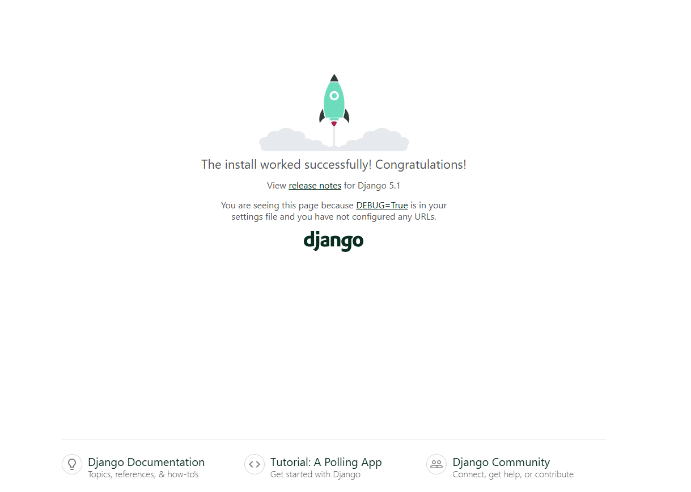
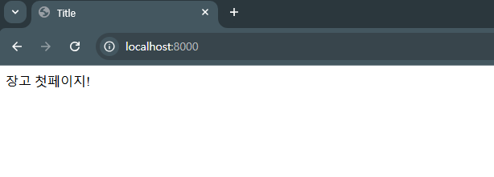
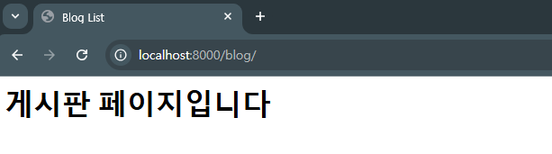
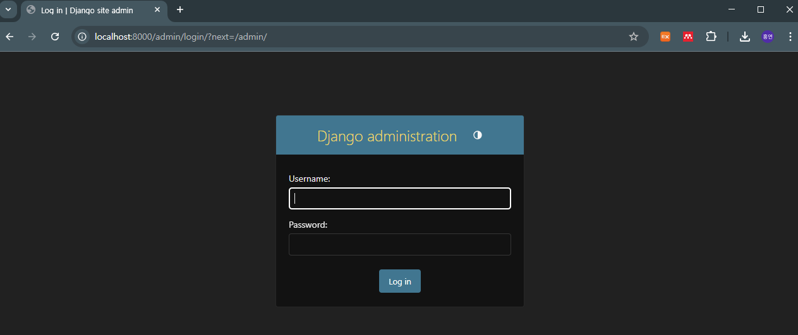
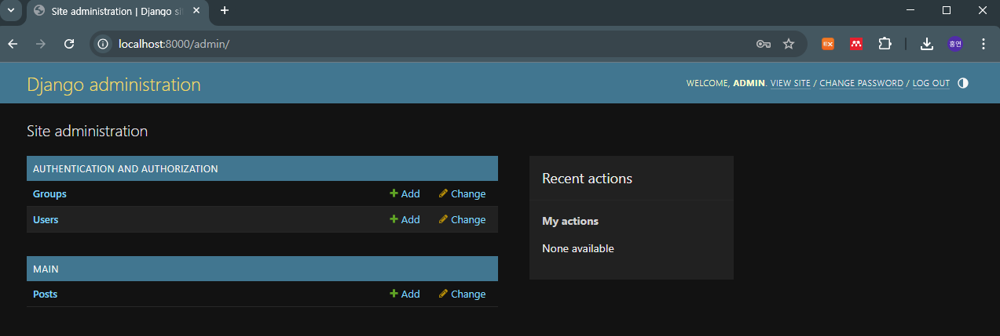
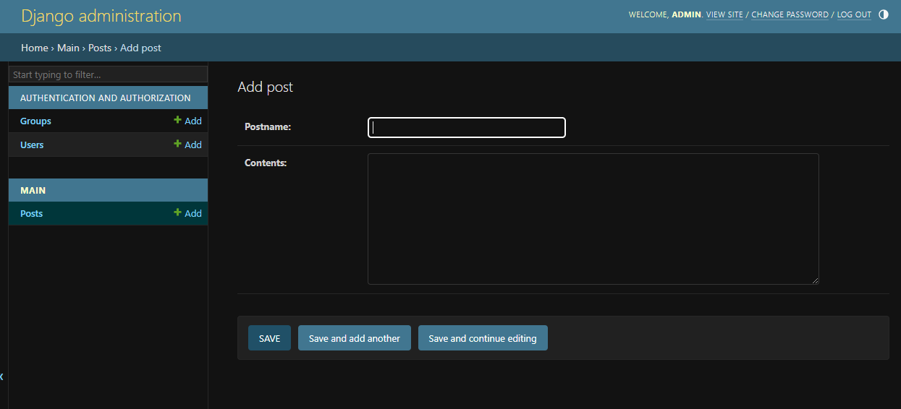

# Django_study

이 문서는 Django의 기본적인 작동 방식을 공부하기 위해 만들어짐.

https://wikidocs.net/91422 의 문서를 참조함.


## 설치 방법

django 모듈 설치.

* Django라는 conda 환경 사용 중임.

```
pip install django

django-admin startproject web_study
```

django 모듈 설치 후 다음 명령어 실행 시 web_study 라는 폴더 생성.


``cd web_study`` 로 해당 폴더에 들어간 후 ``python manage.py migrate`` 명령어로 Sqlite3파일이 생성함. 장고 프로젝트에 생성하는 데이터는 여기 저장된다.

## 서버 생성
이후 서버 생성은 ``python manage.py runserver`` 명령어로 실행.

```
System check identified no issues (0 silenced).
February 10, 2025 - 13:18:17
Django version 5.1.6, using settings 'web_study.settings'
Starting development server at http://127.0.0.1:8000/
Quit the server with CTRL-BREAK.
```
위 와 같은 출력이 나오고 8000번 포트로 생성된 것을 확인할 수 있음. 현재 상태는 아무것도 없기 때문에 페이지를 만들어야함. localhost:8000으로 접속하면 다음 페이지가 보임.



## 페이지 생성

현재는 프로젝트만 만든 상태이고 여기에 페이지를 추가하기 위해서는 App을 만들어야함.
django는 여러개의 HTML과 .py 파일로 이루어진 앱들이 여러개 모여서 만들어진다고 함.
우선 main이라고 하는 앱을 다음 ``python manage.py startapp main``으로 생성.

이렇게 만들어진 main 폴더 안의 web_study/settings.py 를 열어 INSATLLED_APPS에 아래를 추가해서 프로젝트에서 사용될 수 있도록 설정한다.

```python
INSTALLED_APPS = [
    'django.contrib.admin',
    'django.contrib.auth',
    'django.contrib.contenttypes',
    'django.contrib.sessions',
    'django.contrib.messages',
    'django.contrib.staticfiles',
    'main',
]
```

여기까지 하면 이제 app을 만들 수 있는 단계까지 완료한 것. 이제 web_study/main/templates/main 폴더를 하나 만들고 그 안에 index.html 파일을 만들어서 간단하게 알아볼 수 있을 정도로만 웹페이지를 생성함. 아래를 index.html 파일에 쓸 것.

```html
<!DOCTYPE html>
<html lang="en">
<head>
    <meta charset="UTF-8">
    <title>Title</title>
</head>
<body>
    장고 첫페이지!
</body>
</html>
```

이제 위와 같은 내용의 html을 웹에 띄워야함. ``main/view.py`` 파일을 열어 다음 코드를 추가해야 함.

```python
from django.shortcuts import render

# Create your views here.
def index(request):
    return render(request,'main/index.html')
```

마지막으로 우리가 쓸 view와 url을 연결해주면 실행할 수 있음. ``main/urls.py``의 파일을 하나 만들고 아래의 코드를 추가하면 됨.

```python
from django.urls import path

from . import views

urlpatterns = [
    path('', views.index, name='index'),
]
```

이제 main의 url과 프로젝트의 url을 연결해주기 위해 ``web_study/urls.py`` 의 파일에 들어가 다음과 같이 바꿔줘야함.

```python
from django.contrib import admin
from django.urls import path, include

urlpatterns = [
    path('admin/', admin.site.urls),
    path('', include('main.urls')),
]
```

모든 세팅이 완료되었으며, 이제 다시 서버를 ``python manage.py runserver`` 명령어로 띄우면 됨. 아래와 같이 간단한 웹페이지가 생성된 것을 확인할 수 있음.



## HTML 응용

목록 페이지 만들기. 이전에 만든 ``web_study/main/templates/main`` 폴더 안에 ``blog.html`` 파일을 만들어 아래 코드를 입력함.

```html
<html>
    <head>
        <title>Blog List</title>
    </head>
    <body>
        <h1>게시판 페이지입니다</h1>
    </body>
</html>
```

아까와 같이 view.py 파일을 통해 html 상에서 띄울 수 있도록 렌더링 해주는 함수를 입력해야함. ``web_study/main/view.py`` 에 아래와 같이 코드 추가.

```python
# index.html 페이지를 부르는 index 함수
def index(request):
    return render(request, 'main/index.html')
    
# blog.html 페이지를 부르는 blog 함수
def blog(request):
    return render(request, 'main/blog.html')
```

view.py 파일과 url을 연결해주기 위해 ``main/urls.py`` 파일을 만들어 아래와 같이 연결.

```python
from django.urls import path
from .views import *

app_name='main'

urlpatterns=[
    path('',index),
    path('blog/',blog),
]
```
이 경우 현재 path가 2개이고 메인으로 들어갈 페이지가 path('',index)이므로 localhost:8000 페이지로 연결되며, 두 번째의 경로 path('blog/',blog)가 blog.html으로 연결되므로 localhost:8000/blog 로 연결됨.

서버에 연결해서 다음과 같이 출력되는 것을 확인.




## Model (중요)

게시판에서 작동하는 기능들을 구현하는데 필요한 내용으로 생각됨. 실제로 글을 쓸 때 **제목, 글쓴이, 내용 등의 정보**가 저장되는데 어떻게 서버에 저장하고 어떻게 이용할지를 **Model이 지원**함.
즉, 데이터베이스의 작동을 지원해준다고 할 수 있음. Partbank의 목적상 사람들이 올려주는 part, device 등의 정보를 구현하는데 도움이 될 기능임.

우선 ``web_study/main/models.py`` 에 아래의 내용을 추가함.

```python
from django.db import models

# Create your models here.
# 게시글(Post)엔 제목(postname), 내용(contents)이 존재합니다
class Post(models.Model):
    postname = models.CharField(max_length=50)
    contents = models.TextField()
```

제목(최대 길이 50자)와 내용(content)로 구성된 모델을 만들었으며, 이를 데이터베이스에 넣고 장고가 저장함. django의 db에 모델을 migrate 시켜주어야 작동하며, 일반적으로 ``model.py``를 수정했다면 바로바로 ``migrate`` 시켜주어 데이터베이스에 저장되도록 함.

아래 명령어로 migrate.

```
$ python manage.py makemigrations 
$ python manage.py migrate
```

```
결과 :

$ python manage.py makemigrations

Migrations for 'main':
  main\migrations\0001_initial.py
    + Create model Post

$ python manage.py migrate
Operations to perform:
  Apply all migrations: admin, auth, contenttypes, main, sessions
Running migrations:
  Applying main.0001_initial... OK
```

## 권한 설정

관리자(admin)가 게시글(Post)에 접근할 권한을 주고, 게시글을 게시, 삭제, 수정 등의 여러 작업을 할 수 있도록``web_study/main/admin.py``를 수정 해야함.

```python
from django.contrib import admin
# 게시글(Post) Model을 불러옵니다
from .models import Post

# Register your models here.
# 관리자(admin)가 게시글(Post)에 접근 가능
admin.site.register(Post)
```

코드에서 .models의 Post class를 불러와 관리자(admin)를 Post에 접근하도록 등록하는 코드가 보임.

이제 관리자 계정을 만들어야함. Superuser는 장고 프로젝트의 모든 app 및 object를 관리하는 계정임. 계정 생성은 ``manage.py`` 를 통해 Superuser 계정이 생성되며, username, email address, 그리고 password가 필요함.

``python manage.py createsuperuser`` 를 통해 계정을 생성할 수 있고 필요한 내용을 입력하면 됨.
```
Username (leave blank to use 'user'): admin  
Email address: hy3074@kribb.re.kr
Password: 
Password (again):
Superuser created successfully.
```

이제 서버를 실행하고 Superuser 계정을 확인하면 됨. 계정 접속은 ``localhost:8000/admin``으로 접속.



위와 같은 login 화면이 나오고 admin 계정으로 login하면 다음과 같은 화면이 나옴.



위 화면에서 Main-Post의 add 버튼을 눌러 게시물을 작성할 수 있음. 아래와 같은 화면이 나오며 제목과 내용을 입력할 수 있음.



작성을 완료하면 아래와 같이 Post object (1)으로 생성되는 것을 확인할 수 있음. 작동 확인을 위해 아무 post나 하나 더 작성. 이후 postname이 Post object 대신 제목으로 나오게 하기 위해 ``model.py``를 다음과 같이 개선.

```python
from django.db import models

# Create your models here.
# 게시글(Post)엔 제목(postname), 내용(contents)이 존재합니다
class Post(models.Model):
    postname = models.CharField(max_length=50)
    contents = models.TextField()

    # 게시글의 제목(postname)이 Post object 대신하기
    def __str__(self):
        return self.postname
```

맨 아랫줄의 코드가 추가 된 것을 확인할 수 있음. 이는 자신의 postname을 상속받아 출력하도록 설정한 것.

또한, 여전히 blog 페이지에서는 게시글을 볼 수 없는 문제가 남아있음. ``web_study/main/veiws.py``에서 Model의 Post class를 불러올 수 있도록 코드 수정.

```python
from django.shortcuts import render
# View에 Model(Post 게시글) 가져오기
from .models import Post

# index.html 페이지를 부르는 index 함수
def index(request):
    return render(request, 'main/index.html')

# blog.html 페이지를 부르는 blog 함수
def blog(request):
    # 모든 Post를 가져와 postlist에 저장합니다
    postlist = Post.objects.all()
    # blog.html 페이지를 열 때, 모든 Post인 postlist도 같이 가져옵니다 
    return render(request, 'main/blog.html', {'postlist':postlist})
```

 코드에서 .models 로부터 Post class를 불러온 뒤 blog로 설정된 함수 내에서 postlist 내의 객체값 모두를 불러오고 있는 것을 확인할 수 있음.

 blog의 post를 html에서 표시할 수 있도록 ``web_study/main/templates/main/blog.html``파일 또한 다음과 같이 수정.

 ```html
 <html>
    <head>
        <title>Blog List</title>
    </head>
    <body>
        <h1>게시판 페이지입니다</h1>
        <table>
        
            <ul>
                <li>{{list.postname}}</li>
                <li>{{list.contents}}</li>
            </ul>
        
        </table>
    </body>
</html>
 ```

 for 문으로 postlist의 내용을 하나씩 붙여서 보여줌 table 형태로 표시하도록 설정.


